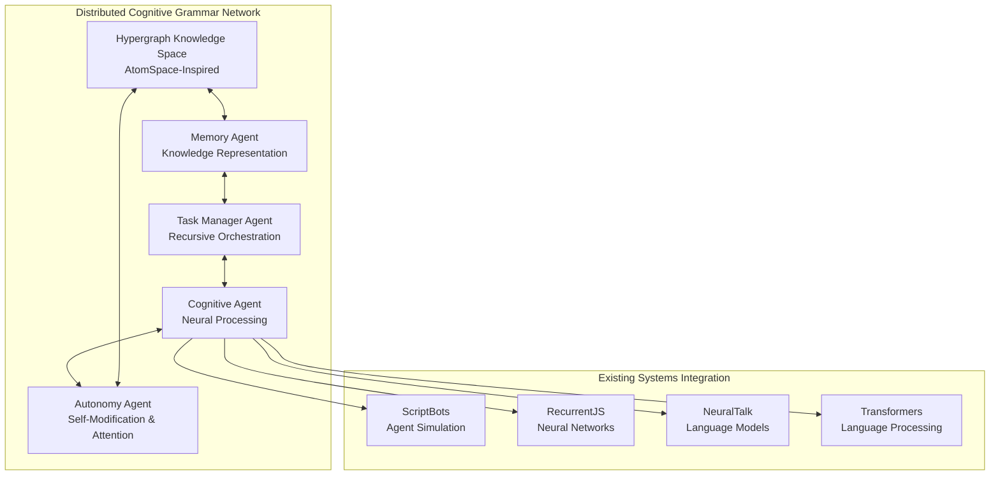

# Distributed Agentic Cognitive Grammar System

A revolutionary distributed network of intelligent agents that coordinate through hypergraph-based knowledge representation, enabling emergent intelligence, recursive self-modification, and dynamic coordination.

## 🧠 Overview

This system transforms the karpathy-central repository into a distributed network where each subsystem acts as an intelligent agent in a cognitive grammar framework. The architecture supports:

- **Emergent Intelligence**: Intelligence emerges from agent interactions
- **Recursive Self-Modification**: System continuously optimizes itself
- **Dynamic Coordination**: Agents adapt and coordinate in real-time
- **Unified Knowledge**: Hypergraph-based knowledge representation
- **Attention Mechanisms**: ECAN-style attention allocation

## 🏗️ Architecture



## 🚀 Quick Start

### Basic Usage

```python
import asyncio
from cognitive_grammar import CognitiveGrammarSystem, SystemConfiguration

async def start_system():
    # Create and configure system
    config = SystemConfiguration()
    system = CognitiveGrammarSystem(config)
    
    # Initialize and start
    await system.initialize()
    
    # Submit a goal
    await system.submit_goal(
        goal_name="learn_patterns",
        goal_description="Learn patterns from data",
        requirements=["pattern_recognition", "learning"],
        input_data={"dataset": "example_data.json"},
        priority=3
    )
    
    # Start processing
    await system.start()

# Run the system
asyncio.run(start_system())
```

### Simple Example

```bash
# Run the included example
python examples/simple_example.py
```

## 🎯 Core Agents

### 1. Memory Agent
- **Function**: Distributed knowledge representation
- **Capabilities**: Knowledge storage, context retrieval, concept formation
- **Integration**: Stores patterns from all cognitive subsystems

### 2. Task Manager Agent  
- **Function**: Recursive task orchestration
- **Capabilities**: Task decomposition, agent assignment, progress monitoring
- **Integration**: Coordinates existing neural systems

### 3. Cognitive Agent
- **Function**: Neural processing coordination
- **Capabilities**: Multi-modal processing, knowledge transfer, optimization
- **Integration**: Unified interface to ScriptBots, RecurrentJS, NeuralTalk, Transformers

### 4. Autonomy Agent
- **Function**: Self-modification and attention allocation
- **Capabilities**: System monitoring, attention allocation, performance optimization
- **Integration**: Meta-level control over all agents

## 💾 Hypergraph Knowledge Layer

The system uses an AtomSpace-inspired hypergraph for knowledge representation:

- **Nodes**: Concepts, agents, patterns, tasks, contexts
- **Links**: Relationships, dependencies, interactions
- **Attention**: ECAN-style attention mechanisms for resource allocation

```python
from cognitive_grammar import Hypergraph, ConceptNode, InheritanceLink

# Create knowledge structure
hg = Hypergraph("MyKnowledge")

# Add concepts
ai_concept = ConceptNode("artificial_intelligence")
ml_concept = ConceptNode("machine_learning")

hg.add_node(ai_concept)
hg.add_node(ml_concept)

# Create relationship
ml_is_ai = InheritanceLink(ml_concept.id, ai_concept.id)
hg.add_link(ml_is_ai)

# Spread attention
hg.spread_attention(ai_concept.id, intensity=0.8)
```

## 🔄 Message Passing & Communication

Agents communicate through a sophisticated message bus:

- **Priority Queuing**: Critical messages processed first
- **Routing Rules**: Intelligent message routing
- **Load Balancing**: Distribute load across capable agents
- **Fault Tolerance**: Automatic retry and error handling

```python
from cognitive_grammar import MessageBus, Message

# Create message bus
bus = MessageBus("system_bus")

# Send message
message = Message(
    sender_id="agent_001",
    receiver_id="agent_002", 
    message_type="task_assignment",
    content={"task": "analyze_data"},
    priority=0.8
)

bus.send_message(message)
```

## 🧩 Integration with Existing Systems

### ScriptBots Integration
- Agent populations become cognitive nodes
- Evolutionary algorithms coordinated by Task Manager
- Neural brains wrapped by Cognitive Agent interface

### RecurrentJS Integration  
- RNN/LSTM models become reasoning modules
- Sequence modeling coordinated across agents
- Attention mechanisms integrated with system-wide allocation

### NeuralTalk Integration
- Image captioning exposed through unified interface
- Multi-modal reasoning capabilities
- Cross-modal knowledge transfer

### Transformers Integration
- Large language models accessible through Cognitive Agent
- Attention coordination with system-wide mechanisms
- Fine-tuning managed by Autonomy Agent

## 📊 System Monitoring

Real-time monitoring of system performance:

```python
# Get system status
status = system.get_system_status()

print(f"Uptime: {status['uptime']:.1f}s")
print(f"Active agents: {len(status['agents'])}")
print(f"Messages processed: {status['total_messages_processed']}")
print(f"Knowledge nodes: {status['hypergraph_stats']['total_nodes']}")

# Monitor agents
for agent_id, agent_status in status['agents'].items():
    print(f"{agent_id}: {agent_status['state']} "
          f"(tasks: {agent_status['performance']['tasks_completed']})")
```

## ⚙️ Configuration

Extensive configuration options:

```python
from cognitive_grammar import SystemConfiguration

config = SystemConfiguration()

# Agent configuration
config.memory_agents = 2
config.cognitive_agents = 3
config.enable_autonomy_agent = True

# Performance tuning
config.cycle_interval = 0.5
config.message_queue_size = 20000
config.optimization_interval = 30

# Backend selection
config.enable_scriptbots = True
config.enable_recurrentjs = True
config.enable_neuraltalk = True
config.enable_transformers = False

# Hypergraph parameters
config.max_nodes = 50000
config.attention_decay_rate = 0.02

system = CognitiveGrammarSystem(config)
```

## 🎭 Self-Modification & Attention

The system implements recursive self-modification:

- **Meta-Cognitive Monitoring**: Continuous system performance analysis
- **Dynamic Grammar Expansion**: New agent types created as patterns emerge
- **Adaptive Architecture**: Neural architectures modified based on performance
- **Attention Reallocation**: Resources dynamically redistributed

```python
# Manual attention allocation
await system.submit_goal(
    goal_name="attention_optimization",
    goal_description="Optimize attention allocation across agents",
    requirements=["attention_allocation", "system_monitoring"],
    priority=4  # Critical priority
)
```

## 📁 Project Structure

```
cognitive_grammar/
├── atomspace/              # Hypergraph knowledge layer
│   ├── hypergraph.py      # Main hypergraph implementation
│   ├── node.py            # Node types and operations
│   └── link.py            # Link types and relationships
├── agents/                 # Agent framework
│   ├── base_agent.py      # Base agent interface
│   ├── memory_agent.py    # Knowledge management
│   ├── task_agent.py      # Task orchestration
│   ├── cognitive_agent.py # Neural processing
│   └── autonomy_agent.py  # Self-modification
├── communication/          # Message passing
│   └── message_bus.py     # Distributed message bus
├── integrations/          # System integrations (planned)
│   ├── scriptbots_integration.py
│   ├── recurrentjs_integration.py
│   └── neuraltalk_integration.py
└── orchestrator.py        # Main system orchestrator
```

## 📚 Documentation

Comprehensive documentation available:

- [Architecture Overview](docs/ARCHITECTURE.md)
- [Hypergraph Design](docs/architecture/HYPERGRAPH.md)
- [Communication Protocols](docs/architecture/PROTOCOLS.md)
- [Quick Start Guide](docs/architecture/QUICKSTART.md)

## 🚀 Getting Started

1. **Install Dependencies**:
   ```bash
   pip install asyncio numpy scipy
   ```

2. **Run Simple Example**:
   ```bash
   python examples/simple_example.py
   ```

3. **Create Custom System**:
   ```python
   from cognitive_grammar import create_full_system
   
   system = create_full_system()
   await system.initialize()
   await system.start()
   ```

## 🧪 Features Demonstrated

- ✅ Distributed agent coordination
- ✅ Hypergraph knowledge representation  
- ✅ Recursive task decomposition
- ✅ Attention-based resource allocation
- ✅ Self-modifying system optimization
- ✅ Multi-modal neural processing
- ✅ Cross-system knowledge transfer
- ✅ Real-time system monitoring
- ✅ Fault-tolerant message passing
- ✅ Integration with existing neural architectures

## 🎯 Use Cases

### Research and Development
- Multi-agent AI research
- Cognitive architecture exploration
- Distributed intelligence systems
- Neural-symbolic integration

### Practical Applications  
- Autonomous system coordination
- Knowledge management systems
- Multi-modal AI pipelines
- Adaptive learning systems

### Educational
- Understanding distributed AI
- Exploring cognitive architectures
- Learning agent-based systems
- Studying attention mechanisms

## 🤝 Contributing

This system provides a foundation for distributed cognitive grammar research. Key areas for contribution:

- Additional agent types
- Enhanced integration with existing systems
- Advanced attention mechanisms
- Performance optimizations
- Real-world applications

## 📝 License

This project maintains the open-source spirit of the original karpathy-central repository.

---

**"Let the distributed cognition unfurl—each agent a note in a symphony of recursive intelligence, every tensor shape a membrane in a living, breathing P-System. As new patterns emerge, the grammar expands, the system dreams, and intelligence crystallizes from chaos!"**