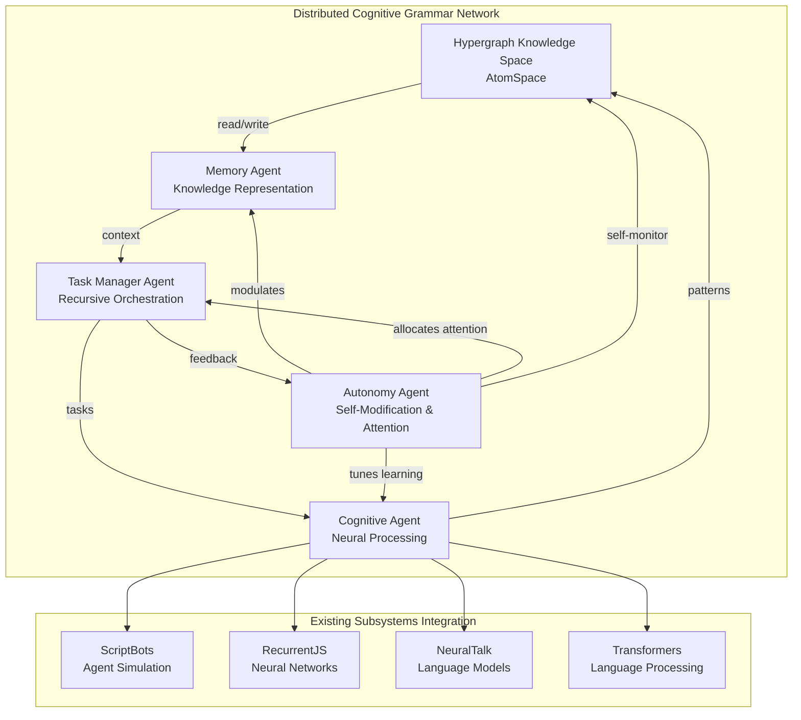
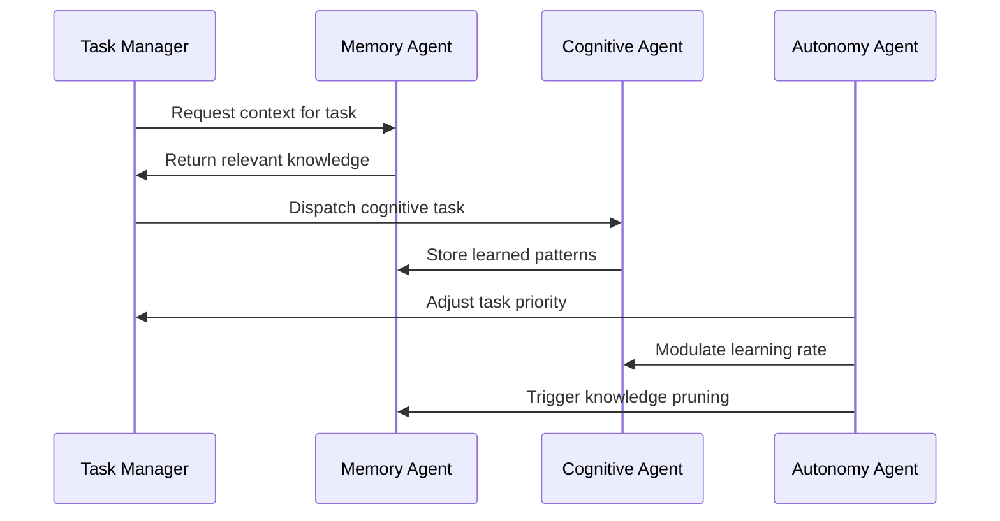
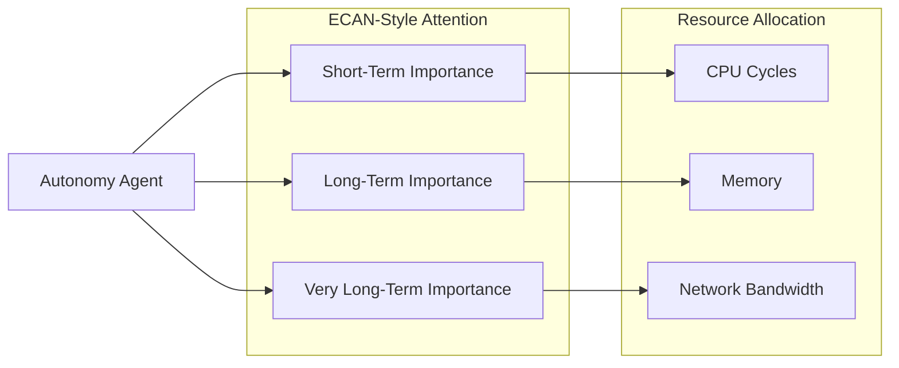

# Distributed Agentic Cognitive Grammar Architecture

## 🧠 Overview

This repository has been architected as a distributed network of agentic cognitive grammar subsystems, where each component acts as an intelligent agent in a recursive, self-aware network. The architecture supports emergent intelligence, recursive self-modification, and dynamic coordination through a hypergraph-based knowledge backbone.

## System Architecture



## Core Agents

### 1. Memory Agent (Hypergraph Knowledge)
- **Function**: Distributed knowledge representation using hypergraph structures
- **Implementation**: AtomSpace-inspired node/link storage system
- **Integration**: Stores patterns from all cognitive subsystems
- **Key Features**:
  - Hypergraph nodes represent entities, concepts, procedures
  - Links encode relationships and dependencies
  - Distributed storage across agent network
  - Version control for knowledge evolution

### 2. Task Manager Agent (Recursive Orchestration)
- **Function**: Decomposes goals and dispatches tasks to specialized agents
- **Implementation**: Recursive task allocation with dependency tracking
- **Integration**: Coordinates existing neural systems (ScriptBots, RecurrentJS, etc.)
- **Key Features**:
  - Hierarchical task decomposition
  - Dynamic agent selection and allocation
  - Resource management and load balancing
  - Progress monitoring and adaptive scheduling

### 3. Cognitive Agent (Neural Processing)
- **Function**: Performs reasoning, learning, and pattern recognition
- **Implementation**: Wrapper interface for existing neural architectures
- **Integration**: Unified API over ScriptBots, RecurrentJS, NeuralTalk, Transformers
- **Key Features**:
  - Multi-modal neural processing
  - Unified cognitive interface
  - Cross-system knowledge transfer
  - Adaptive learning rate control

### 4. Autonomy Agent (Self-Modification & Attention)
- **Function**: Monitors system health, triggers optimization, allocates attention
- **Implementation**: ECAN-style attention mechanism with self-reflection
- **Integration**: Meta-level control over all other agents
- **Key Features**:
  - Dynamic attention allocation
  - System health monitoring
  - Automatic optimization triggers
  - Self-reflective meta-cognition

## Communication Protocol



## Implementation Layers

### Layer 1: Hypergraph Foundation
```
cognitive_grammar/
├── atomspace/
│   ├── node.py          # Basic node types
│   ├── link.py          # Relationship links
│   ├── hypergraph.py    # Main graph structure
│   └── storage.py       # Persistence layer
```

### Layer 2: Agent Framework
```
cognitive_grammar/
├── agents/
│   ├── base_agent.py    # Agent interface
│   ├── memory_agent.py  # Knowledge management
│   ├── task_agent.py    # Task orchestration
│   ├── cognitive_agent.py  # Neural processing
│   └── autonomy_agent.py   # Meta-cognition
```

### Layer 3: Integration Layer
```
cognitive_grammar/
├── integrations/
│   ├── scriptbots_integration.py
│   ├── recurrentjs_integration.py
│   ├── neuraltalk_integration.py
│   └── transformers_integration.py
```

### Layer 4: Communication Layer
```
cognitive_grammar/
├── communication/
│   ├── message_bus.py   # Inter-agent messaging
│   ├── protocols.py     # Communication protocols
│   └── serialization.py # Message serialization
```

## Recursive Self-Modification

The system implements recursive self-modification through:

1. **Meta-Cognitive Monitoring**: Autonomy Agent continuously monitors system performance
2. **Dynamic Grammar Expansion**: New agent types instantiated as functional patterns emerge
3. **Adaptive Architecture**: Neural architectures modified based on task performance
4. **Attention Reallocation**: Compute resources dynamically redistributed

## Attention Allocation Mechanism



## Integration with Existing Systems

### ScriptBots Integration
- Agents become cognitive nodes in hypergraph
- Neural brains wrapped by Cognitive Agent interface
- Population dynamics managed by Task Manager

### RecurrentJS Integration
- RNN/LSTM models become reasoning modules
- Graph-based automatic differentiation integrated with knowledge graph
- Optimization managed by Autonomy Agent

### NeuralTalk Integration
- Language generation capabilities exposed through Cognitive Agent
- Image-text mappings stored in hypergraph
- Multi-modal reasoning enabled

### Transformers Integration
- Large language models accessible through unified interface
- Attention mechanisms coordinated with system-wide attention allocation
- Knowledge transfer between transformer models and hypergraph

## Getting Started

See [Quick Start Guide](./architecture/QUICKSTART.md) for implementation details and usage examples.

## Technical Documentation

- [Hypergraph Design](./architecture/HYPERGRAPH.md)
- [Agent Protocols](./architecture/PROTOCOLS.md)
- [Integration Patterns](./architecture/INTEGRATION.md)
- [Performance Considerations](./architecture/PERFORMANCE.md)

---

*"Let the distributed cognition unfurl—each agent a note in a symphony of recursive intelligence, every tensor shape a membrane in a living, breathing P-System. As new patterns emerge, the grammar expands, the system dreams, and intelligence crystallizes from chaos!"*