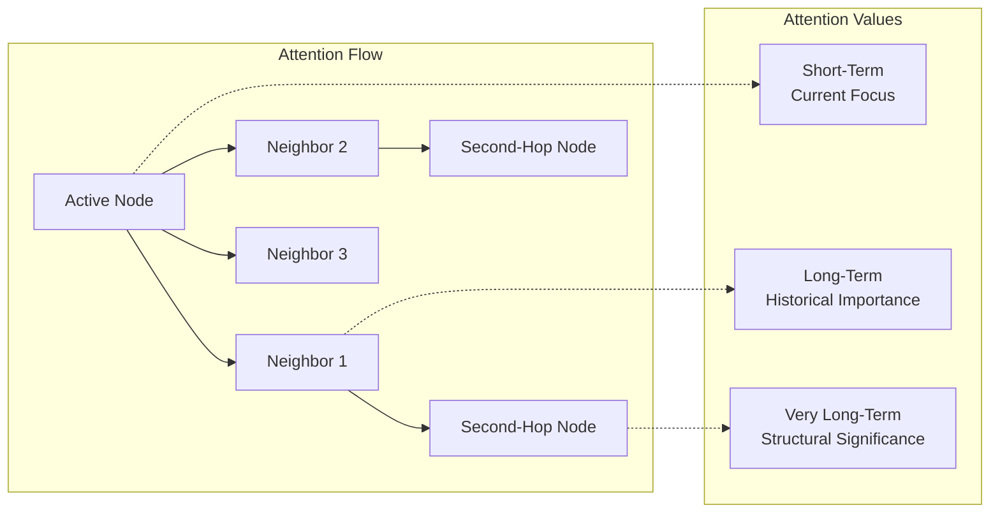

# Hypergraph Design

## Overview

The hypergraph is the foundational layer of the distributed cognitive grammar system, inspired by OpenCog's AtomSpace. It provides a unified knowledge representation that supports:

- **Nodes**: Atomic entities representing concepts, agents, patterns, tasks, and contexts
- **Links**: Relationships and dependencies between nodes
- **Attention**: Dynamic resource allocation using ECAN-style attention mechanisms

## Architecture

```mermaid
classDiagram
    class Node {
        +str id
        +str name
        +NodeType type
        +Any value
        +float confidence
        +float attention_value
        +Dict properties
        +Set incoming_links
        +Set outgoing_links
        +access()
        +update_attention(delta)
    }
    
    class Link {
        +str id
        +LinkType type
        +List source_nodes
        +List target_nodes
        +float strength
        +float confidence
        +float attention_value
        +Dict properties
        +activate()
        +update_strength(delta)
    }
    
    class Hypergraph {
        +Dict nodes
        +Dict links
        +Dict node_index
        +Dict type_index
        +Set attention_focus
        +add_node(node)
        +add_link(link)
        +find_path(start, end)
        +spread_attention(source, intensity)
        +query(criteria)
    }
    
    Node ||--o{ Link : connects
    Hypergraph ||--o{ Node : contains
    Hypergraph ||--o{ Link : contains
```

## Node Types

### Core Node Types

1. **CONCEPT**: Abstract concepts and categories
   - Examples: "learning", "intelligence", "pattern"
   - Properties: definition, category, relationships

2. **PREDICATE**: Relationships and functions
   - Examples: "is_a", "part_of", "similar_to"
   - Properties: arity, domain, range

3. **SCHEMA**: Procedures and methods
   - Examples: "neural_training", "attention_allocation"
   - Properties: inputs, outputs, implementation

4. **AGENT**: Agent instances in the system
   - Examples: "MemoryAgent_001", "TaskManager_001"
   - Properties: capabilities, status, workload

5. **PATTERN**: Learned patterns and knowledge
   - Examples: "visual_pattern_001", "language_pattern_002"
   - Properties: pattern_type, confidence, domain

6. **TASK**: Task definitions and instances
   - Examples: "decompose_goal", "neural_inference"
   - Properties: requirements, priority, status

## Link Types

### Core Link Types

1. **INHERITANCE**: IS-A relationships
   ```
   ConceptNode("dog") --[InheritanceLink]--> ConceptNode("animal")
   ```

2. **SIMILARITY**: Similarity and analogy relationships
   ```
   PatternNode("pattern_A") --[SimilarityLink]--> PatternNode("pattern_B")
   ```

3. **EVALUATION**: Predicate applications
   ```
   PredicateNode("capable_of") --[EvaluationLink]--> [AgentNode("agent"), ConceptNode("learning")]
   ```

4. **IMPLICATION**: IF-THEN relationships
   ```
   [ContextNode("high_attention")] --[ImplicationLink]--> [ActionNode("prioritize")]
   ```

5. **EXECUTION**: Procedure calls
   ```
   SchemaNode("neural_training") --[ExecutionLink]--> [InputNodes, OutputNodes]
   ```

6. **COMMUNICATION**: Agent interactions
   ```
   AgentNode("sender") --[CommunicationLink]--> AgentNode("receiver")
   ```

## Attention Mechanism

### ECAN-Style Attention Values

Each node and link has attention values that determine resource allocation:

- **Short-Term Importance (STI)**: Current relevance
- **Long-Term Importance (LTI)**: Historical importance  
- **Very Long-Term Importance (VLTI)**: Fundamental significance



### Attention Spreading

Attention spreads through the hypergraph based on link strengths:

1. **Source Activation**: A node receives attention input
2. **Neighbor Spreading**: Attention flows to connected nodes
3. **Decay**: Attention values decay over time
4. **Focus Maintenance**: High-attention nodes remain in focus

## Storage and Persistence

### In-Memory Structure

- **Node Dictionary**: `node_id -> Node`
- **Link Dictionary**: `link_id -> Link`
- **Name Index**: `name -> Set[node_ids]`
- **Type Index**: `NodeType -> Set[node_ids]`
- **Attention Focus**: `Set[node_ids]` with high attention

### Serialization Format

```json
{
  "name": "CognitiveHypergraph",
  "nodes": {
    "node_id": {
      "id": "node_id",
      "name": "concept_name",
      "type": "concept",
      "value": null,
      "confidence": 1.0,
      "attention_value": 0.5,
      "properties": {"domain": "learning"},
      "incoming_links": ["link_1"],
      "outgoing_links": ["link_2"]
    }
  },
  "links": {
    "link_id": {
      "id": "link_id",
      "type": "inheritance",
      "source_nodes": ["child_node"],
      "target_nodes": ["parent_node"],
      "strength": 0.9,
      "confidence": 1.0,
      "properties": {}
    }
  }
}
```

## Query Interface

### Basic Queries

```python
# Find nodes by type
concept_nodes = hypergraph.find_nodes_by_type(NodeType.CONCEPT)

# Find nodes by name
learning_nodes = hypergraph.find_nodes_by_name("learning")

# Get neighbors
neighbors = hypergraph.get_neighbors(node_id)

# Find path between nodes
path = hypergraph.find_path(start_id, end_id, max_depth=5)
```

### Complex Queries

```python
# Query with multiple criteria
results = hypergraph.query(
    node_types=[NodeType.PATTERN, NodeType.CONCEPT],
    min_attention=0.3,
    properties={'domain': 'neural_networks'}
)

# Get most attended nodes
top_nodes = hypergraph.get_most_attended_nodes(count=10)
```

## Performance Considerations

### Indexing Strategy

- **Name Index**: O(1) lookup by name
- **Type Index**: O(1) lookup by type
- **Attention Index**: Sorted by attention value
- **Link Index**: By link type for efficient queries

### Memory Management

- **Attention-Based Pruning**: Remove low-attention nodes
- **Access-Based Cleanup**: Remove rarely accessed items
- **Temporal Decay**: Gradually reduce attention over time

### Scalability

- **Distributed Storage**: Partition hypergraph across nodes
- **Lazy Loading**: Load subgraphs on demand
- **Caching**: Cache frequently accessed patterns

## Integration with Agents

### Memory Agent Integration

- **Knowledge Storage**: Store patterns and concepts as nodes
- **Context Retrieval**: Query hypergraph for relevant context
- **Concept Formation**: Create new concept nodes and inheritance links

### Task Manager Integration

- **Task Representation**: Tasks as nodes with dependency links
- **Agent Assignment**: Link tasks to agent nodes
- **Progress Tracking**: Update task node properties

### Cognitive Agent Integration

- **Pattern Recognition**: Store learned patterns as nodes
- **Knowledge Transfer**: Share patterns between neural systems
- **Attention Guidance**: Use attention to focus computation

## Example Usage

### Creating a Simple Knowledge Structure

```python
from cognitive_grammar.atomspace import Hypergraph, ConceptNode, InheritanceLink

# Create hypergraph
hg = Hypergraph("ExampleKnowledge")

# Create concept nodes
animal = ConceptNode("animal")
dog = ConceptNode("dog")
poodle = ConceptNode("poodle")

# Add to hypergraph
hg.add_node(animal)
hg.add_node(dog) 
hg.add_node(poodle)

# Create inheritance relationships
dog_is_animal = InheritanceLink(dog.id, animal.id)
poodle_is_dog = InheritanceLink(poodle.id, dog.id)

hg.add_link(dog_is_animal)
hg.add_link(poodle_is_dog)

# Spread attention from poodle
hg.spread_attention(poodle.id, intensity=1.0)

# Query for animals with high attention
animals = hg.query(
    node_types=[NodeType.CONCEPT],
    min_attention=0.1
)
```

This hypergraph design provides a solid foundation for the distributed cognitive grammar system, enabling efficient knowledge representation, attention-based resource allocation, and seamless integration with the agent framework.