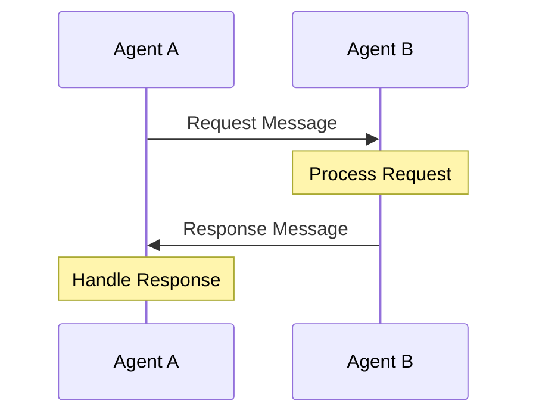
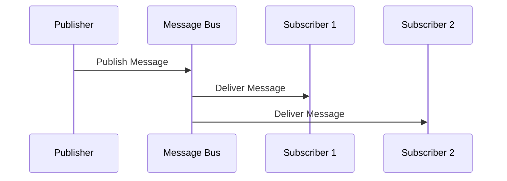
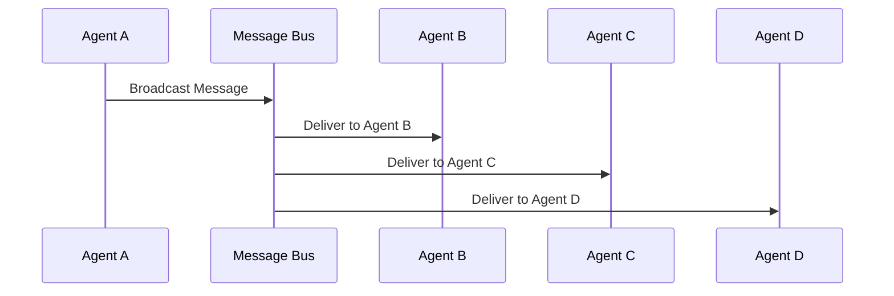
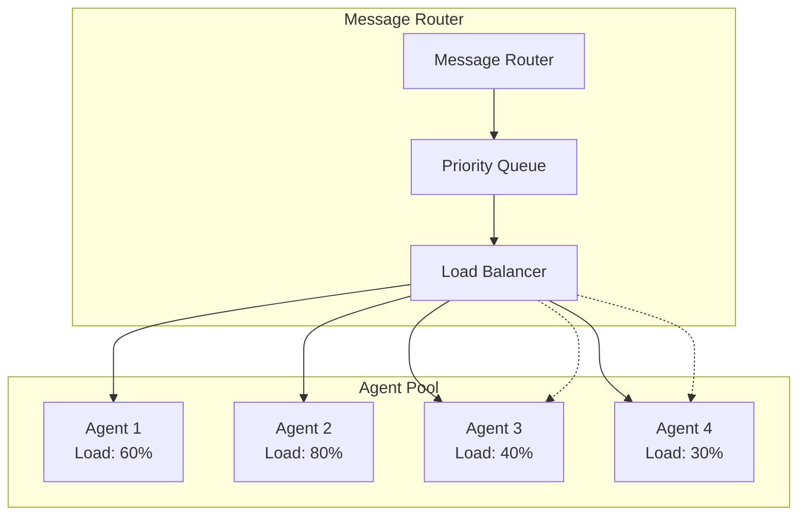
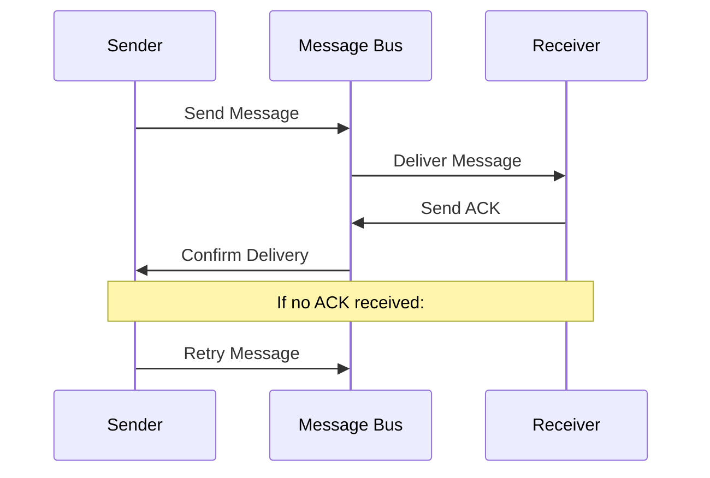

# Agent Communication Protocols

## Overview

The distributed cognitive grammar system uses a message-based communication protocol that enables agents to coordinate, share knowledge, and collaborate on complex tasks. The protocol supports:

- **Asynchronous Communication**: Non-blocking message passing
- **Priority-Based Routing**: High-priority messages processed first
- **Type-Safe Messaging**: Structured message formats
- **Reliable Delivery**: Message acknowledgment and retry mechanisms

## Message Structure

### Core Message Format

```mermaid
classDiagram
    class Message {
        +str id
        +str sender_id
        +str receiver_id
        +str message_type
        +Any content
        +float priority
        +float timestamp
        +bool processed
        +to_dict()
    }
    
    class MessageBus {
        +Dict agent_mailboxes
        +Queue message_queue
        +send_message(message)
        +deliver_messages()
        +broadcast(message_type, content)
        +register_agent(agent_id)
    }
    
    Message ||--o{ MessageBus : routes
```

### Message Types

#### Control Messages

1. **ping/pong**: Heartbeat and connectivity testing
2. **status_request/status_response**: Agent status inquiry
3. **shutdown**: Graceful agent termination
4. **attention_update**: Attention allocation changes

#### Task Management Messages

1. **task_assignment**: Assign task to agent
2. **task_progress**: Progress updates
3. **task_completion**: Task completion notification
4. **task_failure**: Task failure notification
5. **task_cancelled**: Task cancellation

#### Knowledge Management Messages

1. **store_knowledge**: Store information in memory
2. **retrieve_knowledge**: Request information
3. **knowledge_stored/retrieved**: Response messages
4. **find_similar**: Similarity search requests
5. **get_context**: Context retrieval requests

#### Agent Coordination Messages

1. **agent_registration**: Register with system
2. **capability_announcement**: Announce capabilities
3. **resource_request**: Request resources
4. **coordination_proposal**: Propose collaboration

## Communication Patterns

### Request-Response Pattern



### Publish-Subscribe Pattern



### Broadcast Pattern



## Protocol Specifications

### Agent Registration Protocol

1. **Agent Startup**
   ```python
   registration_message = {
       'message_type': 'agent_registration',
       'content': {
           'agent_id': 'memory_agent_001',
           'agent_type': 'MemoryAgent',
           'capabilities': ['knowledge_storage', 'context_retrieval'],
           'status': 'active',
           'endpoints': {'message_port': 8001}
       }
   }
   ```

2. **Registration Confirmation**
   ```python
   confirmation_message = {
       'message_type': 'registration_confirmed',
       'content': {
           'status': 'registered',
           'agent_registry_id': 'reg_12345',
           'system_time': 1234567890.0
       }
   }
   ```

### Task Assignment Protocol

1. **Task Assignment**
   ```python
   task_message = {
       'message_type': 'task_assignment',
       'content': {
           'task_id': 'task_12345',
           'task_type': 'neural_processing',
           'requirements': ['learning', 'pattern_recognition'],
           'input_data': {...},
           'priority': 3,
           'deadline': 1234567890.0
       }
   }
   ```

2. **Task Acceptance**
   ```python
   acceptance_message = {
       'message_type': 'task_accepted',
       'content': {
           'task_id': 'task_12345',
           'estimated_completion': 1234567920.0,
           'resource_requirements': {...}
       }
   }
   ```

3. **Progress Updates**
   ```python
   progress_message = {
       'message_type': 'task_progress',
       'content': {
           'task_id': 'task_12345',
           'progress_percentage': 45.0,
           'current_stage': 'neural_training',
           'estimated_remaining_time': 300.0
       }
   }
   ```

4. **Task Completion**
   ```python
   completion_message = {
       'message_type': 'task_completion',
       'content': {
           'task_id': 'task_12345',
           'result': {...},
           'completion_time': 1234567890.0,
           'performance_metrics': {...}
       }
   }
   ```

### Knowledge Sharing Protocol

1. **Knowledge Storage Request**
   ```python
   storage_message = {
       'message_type': 'store_knowledge',
       'content': {
           'pattern_data': {...},
           'pattern_type': 'neural_activation',
           'confidence': 0.95,
           'domain': 'visual_recognition',
           'related_concepts': ['vision', 'pattern', 'recognition']
       }
   }
   ```

2. **Knowledge Retrieval Request**
   ```python
   retrieval_message = {
       'message_type': 'retrieve_knowledge',
       'content': {
           'query': 'visual pattern recognition',
           'context_size': 10,
           'domain_filter': 'visual_recognition',
           'min_confidence': 0.7
       }
   }
   ```

3. **Knowledge Response**
   ```python
   knowledge_message = {
       'message_type': 'knowledge_retrieved',
       'content': {
           'context_nodes': [...],
           'context_links': [...],
           'total_relevant': 25,
           'query_time': 0.05
       }
   }
   ```

## Message Routing

### Priority Queuing

Messages are processed based on priority levels:

```python
class PriorityLevel:
    CRITICAL = 1.0   # System emergencies
    HIGH = 0.75      # Urgent tasks
    NORMAL = 0.5     # Regular operations
    LOW = 0.25       # Background processes
```

### Load Balancing



### Message Bus Architecture

```python
class MessageBus:
    def __init__(self):
        self.agent_mailboxes = {}
        self.message_queue = PriorityQueue()
        self.routing_table = {}
        self.delivery_stats = {}
    
    def send_message(self, message):
        """Send message to specific agent"""
        self.message_queue.put((message.priority, message))
    
    def broadcast(self, message_type, content, filter_func=None):
        """Broadcast message to multiple agents"""
        for agent_id in self.agent_mailboxes:
            if filter_func is None or filter_func(agent_id):
                message = Message(
                    sender_id='system',
                    receiver_id=agent_id,
                    message_type=message_type,
                    content=content
                )
                self.send_message(message)
    
    def deliver_messages(self):
        """Deliver queued messages"""
        while not self.message_queue.empty():
            priority, message = self.message_queue.get()
            self._deliver_message(message)
```

## Error Handling and Reliability

### Message Acknowledgment



### Timeout and Retry

```python
class ReliableMessaging:
    def __init__(self):
        self.pending_acks = {}
        self.retry_count = {}
        self.max_retries = 3
        self.timeout_seconds = 30.0
    
    def send_with_ack(self, message):
        """Send message with acknowledgment requirement"""
        message.requires_ack = True
        self.pending_acks[message.id] = time.time()
        self.send_message(message)
        
    def handle_timeout(self):
        """Handle message timeouts"""
        current_time = time.time()
        for msg_id, sent_time in list(self.pending_acks.items()):
            if current_time - sent_time > self.timeout_seconds:
                retry_count = self.retry_count.get(msg_id, 0)
                if retry_count < self.max_retries:
                    self.retry_count[msg_id] = retry_count + 1
                    # Resend message
                else:
                    # Mark as failed
                    del self.pending_acks[msg_id]
                    del self.retry_count[msg_id]
```

### Circuit Breaker Pattern

```python
class CircuitBreaker:
    def __init__(self, failure_threshold=5, timeout=60):
        self.failure_threshold = failure_threshold
        self.timeout = timeout
        self.failure_count = 0
        self.last_failure_time = None
        self.state = 'CLOSED'  # CLOSED, OPEN, HALF_OPEN
    
    def call(self, func, *args, **kwargs):
        """Execute function with circuit breaker protection"""
        if self.state == 'OPEN':
            if time.time() - self.last_failure_time > self.timeout:
                self.state = 'HALF_OPEN'
            else:
                raise Exception("Circuit breaker is OPEN")
        
        try:
            result = func(*args, **kwargs)
            self._on_success()
            return result
        except Exception as e:
            self._on_failure()
            raise e
```

## Security Considerations

### Message Authentication

```python
import hmac
import hashlib

class MessageAuth:
    def __init__(self, secret_key):
        self.secret_key = secret_key
    
    def sign_message(self, message):
        """Add authentication signature to message"""
        message_data = json.dumps(message.content, sort_keys=True)
        signature = hmac.new(
            self.secret_key.encode(),
            message_data.encode(),
            hashlib.sha256
        ).hexdigest()
        message.signature = signature
        return message
    
    def verify_message(self, message):
        """Verify message authentication"""
        if not hasattr(message, 'signature'):
            return False
        
        message_data = json.dumps(message.content, sort_keys=True)
        expected_signature = hmac.new(
            self.secret_key.encode(),
            message_data.encode(),
            hashlib.sha256
        ).hexdigest()
        
        return hmac.compare_digest(message.signature, expected_signature)
```

### Access Control

```python
class AccessControl:
    def __init__(self):
        self.permissions = {}
        self.agent_roles = {}
    
    def grant_permission(self, agent_id, resource, action):
        """Grant permission to agent"""
        if agent_id not in self.permissions:
            self.permissions[agent_id] = {}
        if resource not in self.permissions[agent_id]:
            self.permissions[agent_id][resource] = set()
        self.permissions[agent_id][resource].add(action)
    
    def check_permission(self, agent_id, resource, action):
        """Check if agent has permission"""
        agent_perms = self.permissions.get(agent_id, {})
        resource_perms = agent_perms.get(resource, set())
        return action in resource_perms
```

## Performance Optimization

### Message Batching

```python
class MessageBatcher:
    def __init__(self, batch_size=10, batch_timeout=1.0):
        self.batch_size = batch_size
        self.batch_timeout = batch_timeout
        self.batches = {}
        self.last_send_time = {}
    
    def add_message(self, receiver_id, message):
        """Add message to batch for receiver"""
        if receiver_id not in self.batches:
            self.batches[receiver_id] = []
            self.last_send_time[receiver_id] = time.time()
        
        self.batches[receiver_id].append(message)
        
        # Send if batch is full or timeout reached
        if (len(self.batches[receiver_id]) >= self.batch_size or
            time.time() - self.last_send_time[receiver_id] > self.batch_timeout):
            self.send_batch(receiver_id)
```

### Compression

```python
import gzip
import json

class MessageCompression:
    def compress_message(self, message):
        """Compress large message content"""
        content_json = json.dumps(message.content)
        if len(content_json) > 1024:  # Compress if larger than 1KB
            compressed = gzip.compress(content_json.encode())
            message.content = {
                '_compressed': True,
                '_data': compressed
            }
        return message
    
    def decompress_message(self, message):
        """Decompress message content"""
        if (isinstance(message.content, dict) and 
            message.content.get('_compressed')):
            compressed_data = message.content['_data']
            decompressed = gzip.decompress(compressed_data)
            message.content = json.loads(decompressed.decode())
        return message
```

This protocol design enables robust, efficient, and secure communication between agents in the distributed cognitive grammar system.